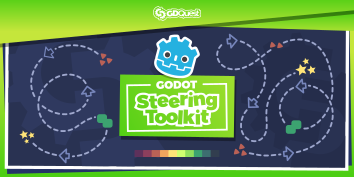

# Godot Steering AI Framework Demos

This project is a collection of demos to showcase and test the [Godot Steering AI Framework](https://github.com/GDQuest/godot-steering-ai-framework).

➡ Follow us on [Twitter](https://twitter.com/NathanGDQuest) and [YouTube](https://www.youtube.com/c/gdquest/) for free game creation tutorials, tips, and news! Get one of our [Godot game creation courses](https://gdquest.mavenseed.com/) to support our work on Free Software.

## Introduction

In the 1990s, [Craig Reynolds](http://www.red3d.com/cwr/) developed algorithms for common AI behaviors. They allowed AI agents to seek out or flee from a target, follow a pre-defined path, or face in a particular direction. They were simple, repeatable tasks that could be broken down into programming algorithms, which made them easy to reuse, maintain, combine, and extend.

While an AI agent's next action is based on decision making and planning algorithms, steering behaviors dictate how it will move from one frame to the next. They use available information and calculate where to move at that moment.

Joining these systems together can give sophisticated and graceful movement while also being more efficient than complex pathfinding algorithms like A\*.

## The demos

This project is a collection of demos to showcase and test the Godot Steering AI Framework. See the [framework's repository](https://github.com/GDQuest/godot-steering-ai-framework) for more details, inspirations, and functionality, as well as installation instructions to code your own games with the framework.

To run the demos themselves, just open the **project.godot** file under /godot/ and run the project with F5.

## Documentation

The framework's documentation and code reference are both available on the [GDQuest](https://www.gdquest.com/docs/godot-steering-ai-framework/getting-started) website.

Here are some guides to get you started:

1. [How to install the framework](https://www.gdquest.com/docs/godot-steering-ai-framework/how-to-install/)
1. [Getting Started](https://www.gdquest.com/docs/godot-steering-ai-framework/getting-started/)
1. [Code reference](https://www.gdquest.com/docs/godot-steering-ai-framework/reference/)

## Contributing

If you encounter a bug or you have an idea to improve the tool, please [open an issue](https://github.com/GDQuest/gdscript-docs-maker/issues/new).

If you want to contribute to the project, for instance by fixing a bug or adding a feature, check out our:

1. [Contributor's guidelines](https://www.gdquest.com/docs/guidelines/contributing-to/gdquest-projects/).
1. [GDScript style guide](https://www.gdquest.com/docs/guidelines/best-practices/godot-gdscript/)

## Support us

Our work on Free Software is sponsored by our [Godot game creation courses](https://gdquest.mavenseed.com/). Consider getting one to support us!

_If you like our work, please star the repository! This helps more people find it._

## Join the community

- You can join the GDQuest community and come chat with us on [Discord](https://discord.gg/CHYVgar)
- For quick news, follow us on [Twitter](https://twitter.com/nathangdquest)
- We release video tutorials and major updates on [YouTube](https://youtube.com/c/gdquest)
